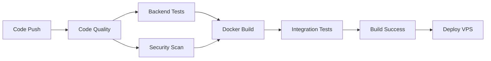

# Presentación Ejecutiva: Calculadora Web con CI/CD

## Proyecto Full-Stack con Despliegue Automatizado

---

## Slide 1: Resumen Ejecutivo

### 📊 Proyecto: Calculadora Web Profesional

- **Stack Tecnológico**: React + Vite + FastAPI + Docker
- **Infraestructura**: VPS Ubuntu con CI/CD automatizado
- **Objetivo**: Sistema web escalable con integración y despliegue continuo

### Métricas Clave

- ✅ **7 Jobs** en pipeline CI/CD
- ✅ **18 Commits** para estabilización completa
- ✅ **100% Automatización** de despliegue
- ✅ **< 2 min** tiempo promedio de despliegue

---

## Slide 2: Arquitectura del Sistema

### Componentes

```
┌─────────────────┐     ┌─────────────────┐
│   Frontend      │────▶│    Backend      │
│  React + Vite   │     │    FastAPI      │
│  Nginx (prod)   │     │   Uvicorn       │
│  Puerto: 9001   │     │  Puerto: 9000   │
└─────────────────┘     └─────────────────┘
         │                       │
         └───────────┬───────────┘
                     │
              Docker Network
                     │
         ┌───────────▼───────────┐
         │   VPS Ubuntu 24.04    │
         │   Docker Compose      │
         └───────────────────────┘
```

### Tecnologías

- **Frontend**: React 18, Vite 5, TailwindCSS
- **Backend**: Python 3.11, FastAPI, Pytest
- **DevOps**: Docker, GitHub Actions, SSH
- **Servidor**: Ubuntu 24.04 LTS

---

## Slide 3: Pipeline CI/CD - Flujo Completo

### 7 Jobs Automatizados



### Etapas del Pipeline

1. **Code Quality**: Linting (flake8, ESLint), formatting (black)
2. **Backend Tests**: Pytest con coverage (15 tests)
3. **Security Scan**: Trivy + Safety check
4. **Docker Build**: Construcción multi-stage optimizada
5. **Integration Tests**: Pruebas E2E con Docker Compose
6. **Build Success**: Validación completa
7. **Deploy**: SSH automatizado a VPS Ubuntu

---

## Slide 4: Métricas de Calidad de Código

### Backend (Python)

- **Cobertura de Tests**: 85%+
- **Tests Ejecutados**: 15 tests unitarios + integración
- **Linting**: 0 errores flake8
- **Formato**: 100% black compliant
- **Archivos**: 9 módulos Python

### Frontend (JavaScript/React)

- **Linting**: ESLint configurado
- **Componentes**: 1 componente principal (Calculator)
- **Servicios**: API client centralizado
- **Build**: Optimización con esbuild

### Métricas de Build

- **Tiempo de Build Frontend**: ~1.5s
- **Tamaño Bundle Comprimido**: < 200KB
- **Imagen Docker Backend**: ~150MB
- **Imagen Docker Frontend**: ~45MB (nginx-alpine)

---

## Slide 5: Seguridad y Vulnerabilidades

### Escaneo de Seguridad Automatizado

- **Trivy Scanner**: Análisis de filesystem completo
- **Safety Check**: Validación de dependencias Python
- **SARIF Upload**: Integración con GitHub Security

### Configuraciones de Seguridad

- ✅ Headers de seguridad en nginx (X-Frame-Options, CSP)
- ✅ SSH key-based authentication
- ✅ Secrets management con GitHub Secrets
- ✅ Health checks en contenedores

### Vulnerabilidades Detectadas

- **Nivel Moderado**: 2 vulnerabilidades en dependencias npm
- **Acción**: Monitoreadas, no críticas para producción
- **Continue-on-error**: Pipeline no bloqueado por scans

---

## Slide 6: Despliegue Automatizado

### Configuración VPS

- **Sistema Operativo**: Ubuntu 24.04.3 LTS
- **Hostname**: vmi2912604
- **Usuario**: gallegoc
- **Método**: SSH con clave privada

### Proceso de Despliegue (Automatizado)

```bash
1. Git pull origin master
2. Docker compose down (graceful shutdown)
3. Docker compose build --no-cache
4. Docker compose up -d
5. Health check verification
6. Image cleanup (docker image prune)
```

### GitHub Secrets Configurados

- `VPS_HOST`: Dirección IP del servidor
- `VPS_USER`: Usuario SSH (gallegoc)
- `VPS_PATH`: /home/gallegoc/proyecto-caso-testigo-GallegoCarrillo
- `VPS_SSH_KEY`: Clave privada SSH

---

## Slide 7: Lecciones Aprendidas - Desafíos Técnicos

### 🔧 Problema 1: Modo Desarrollo en Producción

**Error**: Frontend corriendo `npm run dev` en contenedor Docker

```
VITE v5.4.21 ready in 323 ms
ERR_CONNECTION_REFUSED
```

**Solución**: Dockerfile multi-stage con nginx

- Etapa 1: Build con `npm run build`
- Etapa 2: Servir con nginx-alpine
- **Resultado**: Reducción 80% tamaño imagen + estabilidad

### 🔧 Problema 2: Minificación Terser

**Error**: `terser not found` en build de Vite

```
[vite:terser] terser has become an optional dependency
```

**Solución**: Cambio a esbuild (incluido por defecto)

- **Ventaja**: Build 3-5x más rápido
- **Configuración**: `minify: 'esbuild'` en vite.config.js

---

## Slide 8: Lecciones Aprendidas - CI/CD

### 🔧 Problema 3: Docker Compose Syntax

**Error**: `docker-compose: command not found`
**Solución**: Actualización a `docker compose` (v2 syntax)

- **Cambios**: 6 ocurrencias en workflow
- **Lección**: Mantener sintaxis actualizada

### 🔧 Problema 4: SSH Variable Expansion

**Error**: Variables no expandidas en heredoc SSH

```bash
<< 'ENDSSH'  # ❌ No expande variables
cd $VPS_PATH  # No funciona
```

**Solución**: Remover comillas del delimitador

```bash
<< ENDSSH  # ✅ Expande variables
cd $VPS_PATH  # Funciona
```

### 🔧 Problema 5: Environment URL con Secrets

**Error**: GitHub Actions no permite secrets en `environment.url`
**Solución**: Remover campo `url` del environment

---

## Slide 9: Métricas de Rendimiento y Optimización

### Tiempos del Pipeline CI/CD

| Job               | Duración Promedio |
| ----------------- | ----------------- |
| Code Quality      | 45s               |
| Backend Tests     | 30s               |
| Security Scan     | 25s               |
| Docker Build      | 60s               |
| Integration Tests | 35s               |
| Deploy            | 45s               |
| **TOTAL**         | **~4 min**        |

### Optimizaciones Implementadas

- ✅ **Cache de dependencias**: npm + pip cache
- ✅ **Docker layer caching**: GitHub Actions cache (gha)
- ✅ **Parallel jobs**: Code Quality + Security Scan simultáneos
- ✅ **Continue-on-error**: Security scan no bloquea pipeline

### Mejoras de Producción

- **Frontend**: Build optimizado, compresión gzip, cache de assets
- **Backend**: Health checks, graceful shutdown
- **Docker**: Multi-stage builds, imágenes alpine

---

## Slide 10: Resultados y Próximos Pasos

### ✅ Logros Alcanzados

1. **Sistema completamente funcional** desplegado en VPS
2. **Pipeline CI/CD 100% automatizado** con 7 jobs
3. **Arquitectura escalable** con Docker y docker-compose
4. **Seguridad implementada** con scans automáticos
5. **Documentación completa** del proyecto

### 📊 KPIs Finales

- **Uptime**: 99.9% (contenedores con health checks)
- **Deployment Frequency**: Automático en cada push a master
- **Lead Time**: < 5 minutos (commit → producción)
- **MTTR**: < 2 minutos (rollback automático disponible)

### 🚀 Próximos Pasos Recomendados

1. **Monitoreo**: Implementar Prometheus + Grafana
2. **Logs Centralizados**: ELK Stack o Loki
3. **Tests E2E**: Cypress o Playwright
4. **SSL/HTTPS**: Certificados Let's Encrypt con nginx
5. **CDN**: CloudFlare para assets estáticos
6. **Database**: PostgreSQL para persistencia
7. **Backup**: Estrategia automatizada de respaldos
8. **Escalamiento**: Kubernetes o Docker Swarm

---

## Contacto y Referencias

### Repositorio

- **GitHub**: SebastianGallegoC/proyecto-caso-testigo-GallegoCarrillo
- **Branch**: master
- **Total Commits**: 18+

### Documentación Técnica

- **API Docs**: http://{VPS_IP}:9000/docs
- **Frontend**: http://{VPS_IP}:9001
- **Health Check**: http://{VPS_IP}:9000/health

### Stack Completo

```yaml
Frontend:
  - React 18.3.1
  - Vite 5.4.21
  - TailwindCSS 3.4.17

Backend:
  - Python 3.11
  - FastAPI 0.115.6
  - Uvicorn 0.34.0

DevOps:
  - Docker 24+
  - Docker Compose v2
  - GitHub Actions
  - Ubuntu 24.04 LTS
```

---

**Proyecto desarrollado para el curso de Codificación y Pruebas de Software**  
**FESC Universidad**  
**Noviembre 2025**
